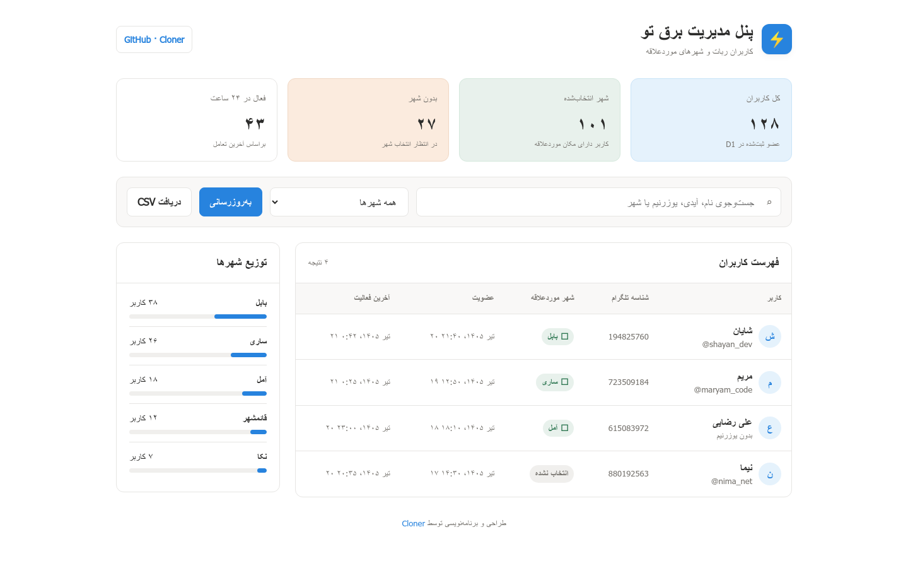

# ⚡️ برق تو — ربات قطعی برق مازندران

یک ربات تلگرامی مبتنی بر **Cloudflare Workers** و **JavaScript** برای دریافت، جست‌وجو و نمایش برنامه خاموشی‌های استان مازندران.

این پروژه اطلاعات را از وب‌سایت برق مازندران  دریافت می‌کند، شهر موردعلاقه کاربران را در **Cloudflare D1** نگه می‌دارد و یک پنل مدیریت واکنش‌گرا برای مشاهده کاربران و شهرهای ذخیره‌شده ارائه می‌دهد.

> این پروژه مستقل است و سامانه رسمی شرکت توزیع برق نیست.



## امکانات

- نمایش خاموشی‌های امروز و فردا
- جست‌وجوی شهر، محله، خیابان و روستا
- ذخیره شهر موردعلاقه هر کاربر
- منوی فارسی و دکمه‌های تلگرامی
- ذخیره کاربران در Cloudflare D1
- پنل مدیریت محافظت‌شده با رمز عبور
- جست‌وجو و فیلتر کاربران در پنل
- نمایش توزیع کاربران براساس شهر
- خروجی CSV از کاربران
- مدیریت Cookie Challenge منبع داده
- طراحی واکنش‌گرا برای دسکتاپ و موبایل

## فناوری‌ها

- JavaScript
- Cloudflare Workers
- Cloudflare D1
- Telegram Bot API
- HTML/CSS بدون وابستگی خارجی

## پیش‌نیازها

1. حساب Cloudflare
2. یک ربات ساخته‌شده با `@BotFather`
3. دیتابیس Cloudflare D1

## نصب بدون Wrangler

### ۱. ساخت Worker

در داشبورد Cloudflare وارد بخش **Workers & Pages** شوید و یک Worker جدید بسازید. محتوای فایل `worker.js` را در ویرایشگر Cloudflare قرار دهید.

### ۲. اتصال D1

در تنظیمات Worker، دیتابیس D1 را با نام Binding زیر متصل کنید:

```text
bargheto
```

جدول `bot_users` هنگام اولین اجرا به‌صورت خودکار ساخته می‌شود.

### ۳. تعریف متغیرها و Secretها

از مسیر زیر وارد بخش متغیرها شوید:

```text
Worker → Settings → Variables and Secrets
```

موارد زیر را تعریف کنید:

| نام | نوع پیشنهادی | توضیح |
|---|---|---|
| `BOT_TOKEN` | Secret | توکن ربات تلگرام |
| `WEBHOOK_SECRET` | Secret | رشته تصادفی طولانی برای مسیر Webhook |
| `ADMIN_PASSWORD` | Secret | رمز ورود به پنل مدیریت |
| `ADMIN_USERNAME` | Variable | نام کاربری پنل؛ در صورت حذف، `admin` استفاده می‌شود |

نمونه مقدار برای `WEBHOOK_SECRET`:

```text
یک رشته تصادفی حداقل ۳۲ کاراکتری
```

هیچ‌یک از مقادیر واقعی را داخل کد یا GitHub قرار ندهید.

### ۴. ثبت Webhook

پس از Deploy، آدرس زیر را در مرورگر باز کنید:

```text
https://YOUR-WORKER.workers.dev/setup
```

مرورگر نام کاربری و رمز پنل مدیریت را درخواست می‌کند. پس از ورود، Webhook و دستورات ربات ثبت می‌شوند.

### ۵. آزمایش ربات

در تلگرام این دستورها را امتحان کنید:

```text
/start
/test
/debug
```

## پنل مدیریت

پنل از مسیر زیر در دسترس است:

```text
https://YOUR-WORKER.workers.dev/admin
```

ورود با `ADMIN_USERNAME` و `ADMIN_PASSWORD` انجام می‌شود.

## مسیرهای Worker

| مسیر | کاربرد |
|---|---|
| `/` | وضعیت اولیه Worker |
| `/health` | بررسی سلامت و تعداد کاربران |
| `/setup` | ثبت Webhook و دستورات ربات |
| `/admin` | پنل مدیریت |
| `/admin/api/users` | API داخلی پنل |
| `/admin/export.csv` | خروجی CSV کاربران |

## ساختار دیتابیس

اطلاعات زیر برای هر کاربر ذخیره می‌شود:

- شناسه تلگرام
- یوزرنیم
- نام
- شهر موردعلاقه
- تاریخ عضویت
- آخرین فعالیت

## امنیت

- توکن ربات و رمز پنل را فقط به‌صورت Cloudflare Secret ذخیره کنید.
- مسیر `/setup` با اطلاعات ورود مدیر محافظت شده است.
- پس از افشای احتمالی توکن، آن را فوراً از طریق `@BotFather` باطل کنید.
- Repository را برای Secretهای احتمالی بررسی کنید.

## نکته درباره منبع داده

ساختار HTML یا سیاست دسترسی وب‌سایت منبع ممکن است تغییر کند. دستور `/debug` برای بررسی وضعیت دریافت، Cookie Challenge و تعداد رکوردهای استخراج‌شده در نظر گرفته شده است.

## توسعه‌دهنده

ساخته‌شده توسط **Cloner — Shayan Alinezhad**

- GitHub: [Shayan-alinezhad](https://github.com/Shayan-alinezhad)

## مجوز

این پروژه تحت مجوز [MIT](LICENSE) منتشر می‌شود.
